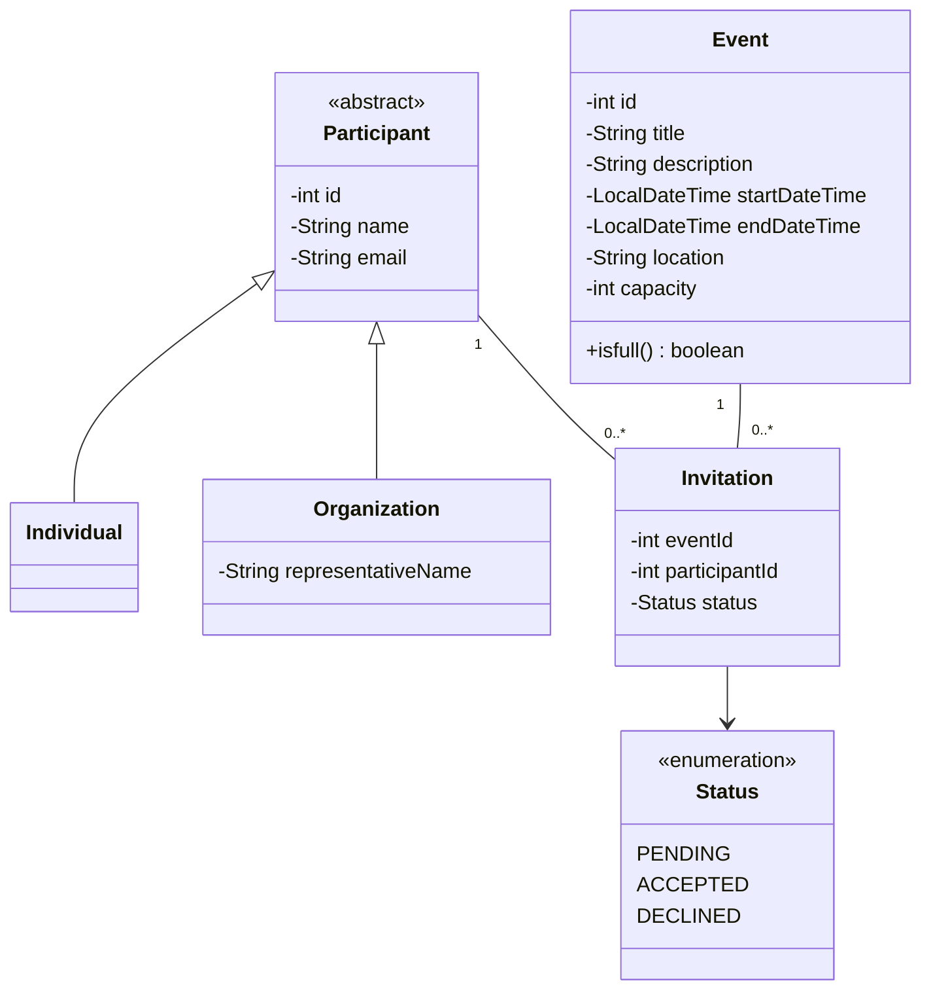

# Community Center Event Management System

A Java-based console application designed for community centers to organize workshops, meetups, and trainings. This project manages participants, event scheduling, and invitation tracking using a robust OOP architecture and SQL integration.

## 📋 Scenario
The application allows staff members to create events with specific capacities and locations. Participants (individuals or organizations) can be invited, and the system tracks their response status (PENDING, ACCEPTED, DECLINED) while ensuring no overbooking or duplicate invitations occur.

## ✨ Key Features
- **Participant Management:** Register individuals and organizational representatives.
- **Event Coordination:** Manage titles, descriptions, time ranges, and locations.
- **Invitation Logic:** 
    - Track invitation statuses.
    - Prevent duplicate invites for the same participant/event.
    - Automatic capacity validation (prevents accepting more participants than the limit).
- **Dynamic Views:** Filter upcoming events and attendance lists using Java Streams and Lambdas.
- **Data Persistence:** Full SQL + JDBC integration for reliable data storage.

## 🛠️ Tech Stack
- **Language:** Java 17+
- **Database:** MySQL 8.0+ (via JDBC)
- **API:** JDBC (Java Database Connectivity)
- **Version Control:** Git (using feature branching strategy)

## ✅ Requirements Met
- **Domain Modeling:** UML-based class structure.

- **OOP Principles:** Abstraction, Encapsulation, Inheritance, and Polymorphism.
- **Clean Code:** Meaningful naming, exception handling, and modular logic.

## 🚀 How to Run
1. Clone the repository.
2. Execute the provided `schema.sql` in your MySQL environment.
3. Update the database connection credentials in the `DatabaseConfiguration` class.
4. Run `Main.java` to start the console menu.
